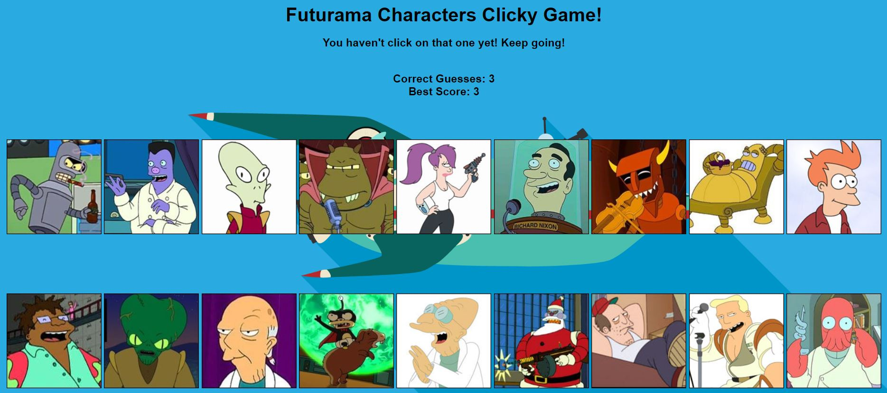

# Clicky-Game

## Instructions

1. Create a new React application using Create React App.

2. The app should render 20 different images to the screen. Each image should listen for click events.

3. The app should keep track of the user's score. The user's score should be incremented when clicking an image for the first time. The user's Correct Guesses should be reset to 0 if they click the same image more than once.

4. Every time an image is clicked, the images rendered to the page should shuffle themselves in a random order.

## Technologies used

* React
* ES6
* Bootstrap
* CSS

